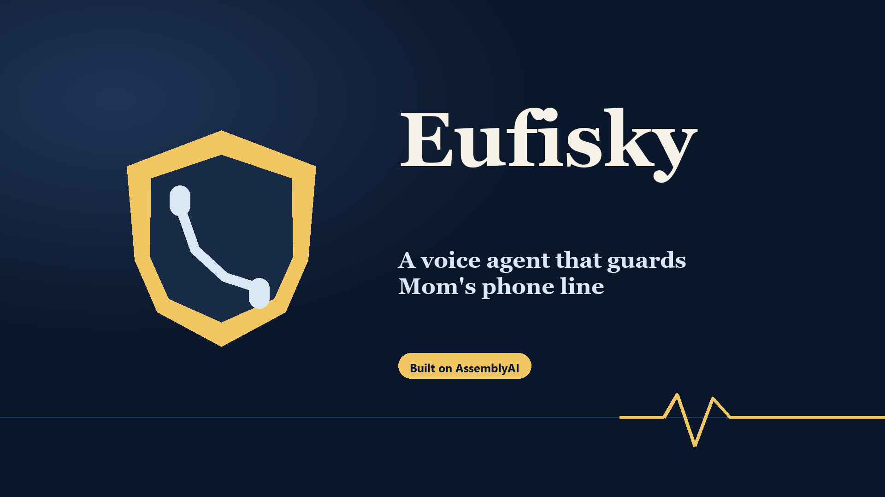
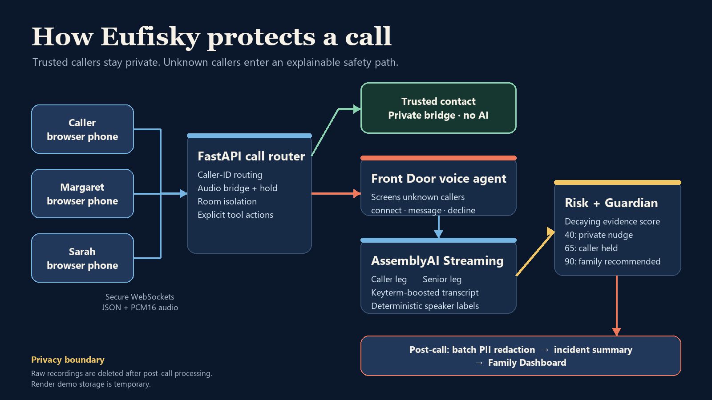

# Eufisky

**A voice agent that guards Mom's phone line—before a suspicious conversation becomes a loss.**

[](https://eufisky.onrender.com/?room=demo)

Eufisky is a browser-based phone-line simulation built for the AssemblyAI
Voice Agents Challenge. It gives older adults a calm layer of protection
without monitoring the people they already trust.

## What it does

- Routes trusted contacts straight through without transcription or AI processing.
- Lets a Front Door voice agent answer unknown callers and ask who is calling and why.
- Monitors each connected audio leg with AssemblyAI Universal Streaming, then applies a deterministic, explainable scam-risk score.
- Pauses risky callers for a private Guardian conversation and produces a PII-redacted incident summary after the call.

## Live demo

**[Open Eufisky](https://eufisky.onrender.com/?room=demo)** ·
[Slides](https://eufisky.onrender.com/slides) ·
[API health](https://eufisky.onrender.com/api/health)

The free Render service may need about 40 seconds to wake after a quiet period.
Once it is warm, try the complete story in about 60 seconds:

1. Open the [Family Dashboard](https://eufisky.onrender.com/dashboard?room=demo).
2. Confirm the header says **Live · room demo**.
3. In **Live**, choose **Fast (4×)** and click **Replay demo call**.
4. Watch the caller transcript, evidence chips, risk score, and Guardian state update together.
5. Open **History** when the replay finishes to inspect the incident report and redacted transcript.

For a live call, open
[Caller](https://eufisky.onrender.com/caller?room=demo),
[Margaret](https://eufisky.onrender.com/senior?room=demo),
[Sarah](https://eufisky.onrender.com/family?room=demo), and the dashboard with the
same `?room=` value. **Type-to-talk is the most reliable presentation path**;
microphone mode also works over HTTPS after browser permission is granted.

## Architecture



```text
Caller ─┐
Senior ─┼─ secure WebSockets ─> FastAPI call router ─> trusted: private bridge
Family ─┘                              │
                                      └─ unknown: Front Door voice agent
                                             │ connect
                ┌────────────────────────────┴────────────────────────────┐
                │ AssemblyAI stream: caller  AssemblyAI stream: senior   │
                └──────────────────────┬──────────────────────────────────┘
                                       v
                          deterministic risk engine
                    score 40: chime · 65: Guardian · 90: family
                                       │
                                       v
                       batch PII redaction + incident summary
                                       │
                                       v
                         SQLite history + Family Dashboard
```

The two connected audio legs use independent streaming sessions, which gives
every transcript segment a deterministic caller/senior label. See
[the architecture reference](docs/ARCHITECTURE.md) for the state machine,
formula, escalation ladder, and data model.

## How AssemblyAI is used

| Feature | Where it is used | Why it matters |
|---|---|---|
| Voice Agent API | Front Door and Guardian sessions in `app/agent/` | Natural screening and private safety conversations can act only through registered tool calls. |
| Universal Streaming | One session per connected audio leg in `app/stt/assemblyai_stream.py` | Low-latency caller/senior transcripts retain a reliable speaker label for risk decisions. |
| Keyterm prompting | Scam vocabulary supplied by the streaming adapter | Improves recognition of names and fraud phrases such as “Medicare number” and “gift card.” |
| Batch transcription + PII redaction | Post-call pipeline in `app/postcall/pipeline.py` | Produces a safer family record and requests redacted audio when available. |
| LeMUR-style summary generation | AssemblyAI LLM Gateway call in the post-call pipeline | Turns the redacted transcript into a plain-English incident object; a deterministic template is the fallback. |

## Privacy by design

- Trusted numbers bypass Front Door, streaming transcription, risk scoring, and post-call analysis.
- Unknown calls are processed only after screening and connection.
- Caller and senior audio stay on separate legs; risk evidence records the speaker and phrase that changed the score.
- Post-call analysis requests entity-name PII substitution before summary generation.
- Raw call recordings are deleted after post-call processing; Render demo storage is temporary and resets may erase demo data.
- The demo has no accounts or authentication. Use invented information only.

## Limitations

- This is a simulated browser phone line, not a carrier service. Twilio/real telephony is roadmap work.
- Caller ID can be spoofed; a production version needs carrier attestation and stronger identity signals.
- The submitted demo remains English-only. Optional Spanish transcription and
  risk monitoring is behind a default-off feature flag; agents still speak
  English.
- Stretch controls, checks, and one-line demos are listed in
  [`docs/STRETCH_FEATURES.md`](docs/STRETCH_FEATURES.md).
- Browser speech, microphone behavior, and free-host cold starts vary by device.
- A deterministic score reduces model guesswork but does not guarantee that every scam is caught or every legitimate call passes.
- Post-call summary generation uses AssemblyAI's LLM Gateway as the current LeMUR successor, with a template fallback if the provider is unavailable.

## Local setup

Python 3.12 is recommended. From PowerShell:

```powershell
py -3.12 -m venv .venv
Set-ExecutionPolicy -Scope Process Bypass
.\.venv\Scripts\Activate.ps1
python -m pip install -r requirements.txt
Copy-Item .env.example .env
notepad .env
python -m uvicorn app.main:app --port 8000
```

Add an AssemblyAI API key to `.env`; never commit that file. Then open
<http://localhost:8000/?room=demo>.

## Tests

```powershell
.\.venv\Scripts\python.exe -m pytest -q
.\.venv\Scripts\python.exe tools\smoke_public.py https://eufisky.onrender.com
```

The checked-in release passes 77 tests. The public smoke tool verifies health,
SQLite access, every page, secure dashboard WebSockets, Replay events, and
completion.

## Submission kit

- [Ready-to-paste submission copy and scripts](docs/SUBMISSION.md)
- [Business case](docs/BUSINESS.md)
- [Three-minute demo guide](docs/DEMO_SCRIPT.md)
- [Printable slide deck](https://eufisky.onrender.com/slides?print-pdf)

## License

Released under the [MIT License](LICENSE).
